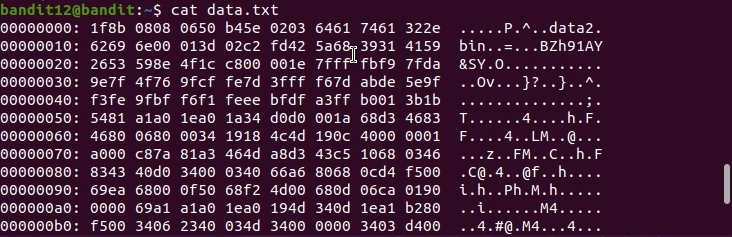
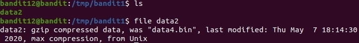

# OverTheWire
## Bandit Level 12 → Level 13
## Level Goal

The password for the next level is stored in the file data.txt, which is a hexdump of a file that has been repeatedly compressed. For this level it may be useful to create a directory under /tmp in which you can work using mkdir. For example: mkdir /tmp/myname123. Then copy the datafile using cp, and rename it using mv (read the manpages!)

## Commands you may need to solve this level

grep, sort, uniq, strings, base64, tr, tar, gzip, bzip2, xxd, mkdir, cp, mv, file

## Helpful Reading Material

    Hex dump on Wikipedia

-------------------------------------------------------------------------------------------------------------------------------------------------------------------------------

1. Connect via ssh:

    `ssh bandit10@bandit.labs.overthewire.org -p 2220`
    The password is: **5Te8Y4drgCRfCx8ugdwuEX8KFC6k2EUu**

2. I'm going to create new directory inside the tmp directory. 

    `mkdir /tmp/bandit1`

3. I read the text file and it gives me some hex code on screen. 

    

4. I know that the **xxd** command can do a hexdump or the reverse. So, I read the man pages and settle on using the **-r** option to reverse the hexdump back to binary. 

    `xxd -r data.txt /tmp/bandit1/data.bin`

5. Now using the **file** command let's see what we can find out about our newly reversed binary file. 

    `file /tmp/bandit1/data.bin`

    

4. This gives us some really good information on the file and what to do next. I will attempt to uncompress data2.bin. 
    I will move into the tmp file where the data.bin file is located to make it easier to work with commands. 
    `cd /tmp/bandit1`
    After reading the gzip help commands I settle on this: 
    `gzip -dN data.bin`
    Which gave me errors of unknown extension. I went back into the man pages on gzip and finally hit a piece where it states that gunzip **takes a list of files on its command line and replaces each file whose name ends with .gz, -gz, .z, or _z...** I take it that the gzip command doesn't like that I named the end of the file with `.bin`. I will now change that. 
    `mv data.bin data.gz`
    I then try to gunzip again. 
    `gunzip -dN data.gz`
    It works this time. Decompressing the file to **data2.bin** just like the file command output said it was originally named. 
    
5. I run the newly decompressed data2.bin file into the **file** command to see what type of file it is. 
    `file data2.bin`

Output is:
    

6. I need to decompress the bzip2 file only after reading the man pages. Bzip decompresses just like gzip. You need a file extension that it will recognise. 
    First rename the file:
    `mv data2.bin data2.bz2`
    Now decompress: 
    `bzip2 -d data2.bz21`
    Output: 
    

7. The newly decompressed data2 is a gzip compressed data file. So, I will rename it with a gzip friendly extension and decompress. 
    `mv data2 data2.gz`
    Decompress that file:
    `gzip -d data2.gz`
    Output: 
    
    We now have a tar archive. 
8. Just to note I forgot to add the -N on the last gzip command which would have preserved the original name of the compress file, instead it named it data2. Which is fine, because the **file** command let us know that it was decompressed to a tar archive file. 
I will now untar that archive. 
    `tar -xf data2`
This gives us a file called **data5.bin**

9. After running **data5.bin** through the **file** command we see that it is a tar archive as well.

    `tar -xvf data5.bin`

10. I now have a new unarchived **data6.bin**. The **file** command tells me that is bzip2 compressed data file. So I must first rename the file before decompressing it. 
Rename it: 
    `mv data6.bin data6.bz2`
Decompress it: 
    `bzip2 -d data6.bz2`
11. This gives us a tar archive with the name: **data6**. I will now untar the file. 
    `tar -xvf data6`
This gives me a **data8.bin** file which is a gzip compressed data file originally named data9.bin according to the **file** command output. 

12. Rename data8.bin
    `mv data8.bin data8.gz`
Decompress:
    `gzip -dN data8.gz`
13. I now have a decompressed **data9.bin** which is a ASCII text file. 
    

14. Read data9.bin
    `cat data9.bin`

    

The password for the next level is: **8ZjyCRiBWFYkneahHwxCv3wb2a1ORpYL**

