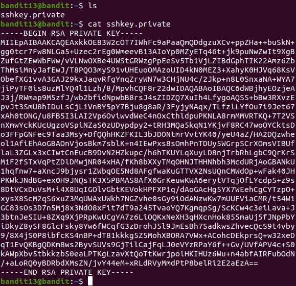
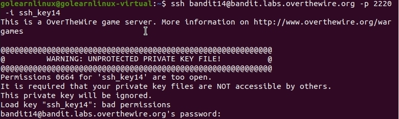
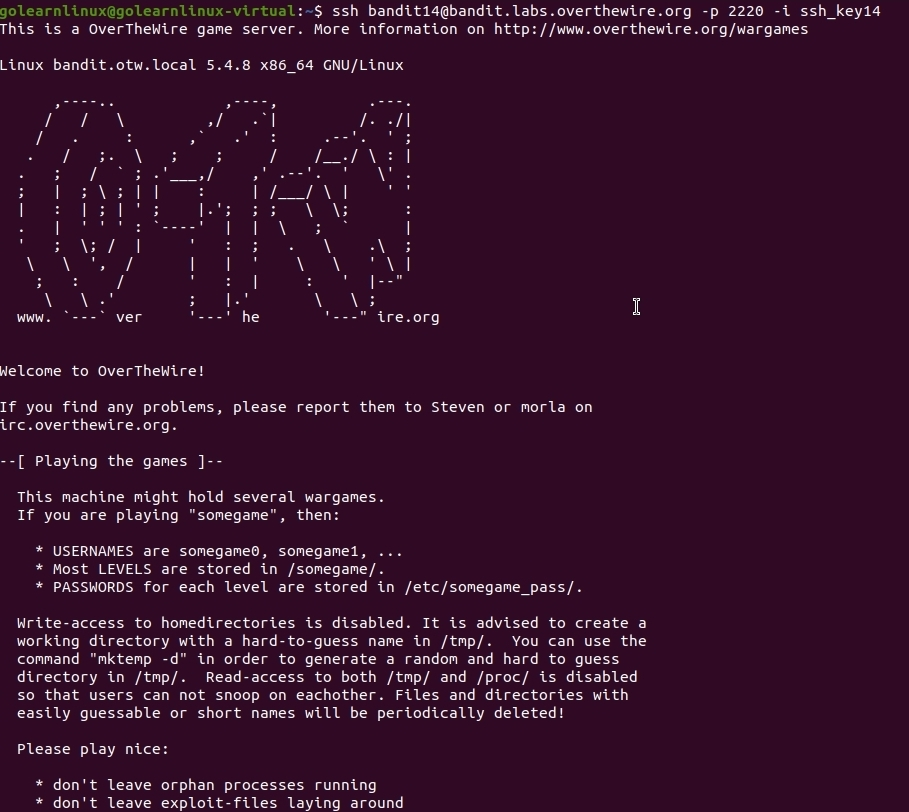
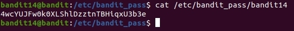

# OverTheWire
## Bandit Level 13 → Level 14
## Level Goal

The password for the next level is stored in /etc/bandit_pass/bandit14 and can only be read by user bandit14. For this level, you don’t get the next password, but you get a private SSH key that can be used to log into the next level. Note: localhost is a hostname that refers to the machine you are working on

## Commands you may need to solve this level

ssh, telnet, nc, openssl, s_client, nmap

## Helpful Reading Material

    SSH/OpenSSH/Keys

----------------------------------------------------------------------------------------------------------

1. Connect via ssh:

    `ssh bandit10@bandit.labs.overthewire.org -p 2220`
    The password is: **8ZjyCRiBWFYkneahHwxCv3wb2a1ORpYL**

2. Let's take a look at the private key. 

    

3. At this point I just copied the private key into a new text file with vi on my local machine: 

    `vi ssh_key14`

4. I then trid to ssh into the server with -i option for the ident file.

    `ssh bandit14@bandit.labs.overthewire.org -p 2220 -i ssh_key14`

5. That wasn't going to work because the ssh client doesn't like the permissions to be relaxed on an ident file. 

    

6. To fix the permissions I make it so no one else can read that file. 

    `chmod 700 ssh_key14`

7. It worked. 

    

8. Now you got to go into the password file located here:  **/etc/bandit_pass/bandit14**

9. The password for the next level is: **4wcYUJFw0k0XLShlDzztnTBHiqxU3b3e**

    
