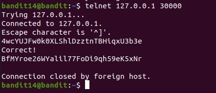

# OverTheWire
## Bandit Level 14 → Level 15
## Level Goal

The password for the next level can be retrieved by submitting the password of the current level to port 30000 on localhost.

## Commands you may need to solve this level

ssh, telnet, nc, openssl, s_client, nmap

## Helpful Reading Material

    How the Internet works in 5 minutes (YouTube) (Not completely accurate, but good enough for beginners)
    IP Addresses
    IP Address on Wikipedia
    Localhost on Wikipedia
    Ports
    Port (computer networking) on Wikipedia

 --------------------------------------------------------------------------------------------------------------------------------

1. Connect via ssh:

    `ssh bandit14@bandit.labs.overthewire.org -p 2220 -i <ident file location>`
    The password is: **4wcYUJFw0k0XLShlDzztnTBHiqxU3b3e** 

2. Using the ssh key you got from the last level login to the level14. 

3. After looking at the instructions I didn't understand what they meant by submit the current level password. I then noticed the hint commands contained telnet. 

I went for this command: 

4. `telnet 127.0.0.1 30000`

    

5. Password for the next level: **BfMYroe26WYalil77FoDi9qh59eK5xNr**

