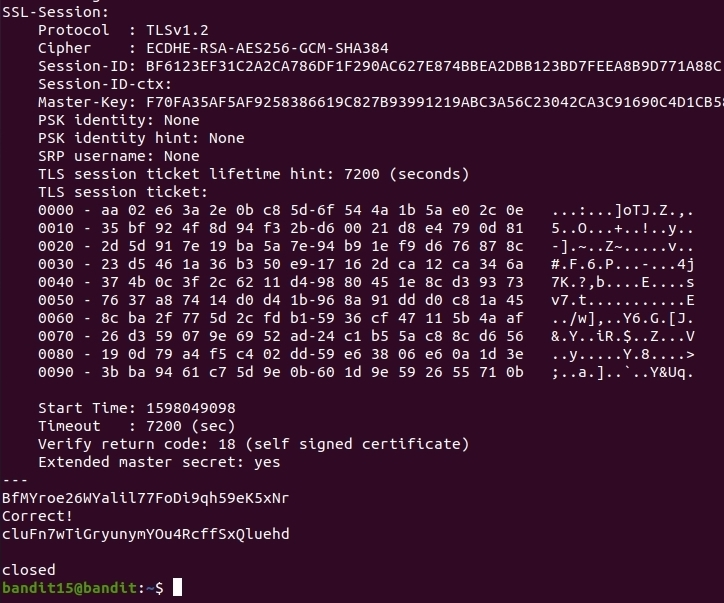

# OverTheWire
## Bandit Level 15 → Level 16
## Level Goal

The password for the next level can be retrieved by submitting the password of the current level to port 30001 on localhost using SSL encryption.

Helpful note: Getting “HEARTBEATING” and “Read R BLOCK”? Use -ign_eof and read the “CONNECTED COMMANDS” section in the manpage. Next to ‘R’ and ‘Q’, the ‘B’ command also works in this version of that command…
## Commands you may need to solve this level

ssh, telnet, nc, openssl, s_client, nmap
## Helpful Reading Material

    Secure Socket Layer/Transport Layer Security on Wikipedia
    OpenSSL Cookbook - Testing with OpenSSL

------------------------------------------------------------------------------------------------------------------------------------------

1. `ssh bandit15@bandit.labs.overthewire.org -p 2220`
    password: BfMYroe26WYalil77FoDi9qh59eK5xNr

2.  I started going the the man pages of the helpful commands. I had no idea what OTW wanted me to do. My main goal here is to only use man pages to solve these levels. 

After a few scans through some man pages I was able to piece together this command. 

`openssl s_client -connect:127.0.0.1:30001`

Once I was connected via openssl I put in the password obtained from the last level as the goal level instructed me to do. 
Paste Password: **BfMYroe26WYalil77FoDi9qh59eK5xNr**

Password for the next level: **cluFn7wTiGryunymYOu4RcffSxQluehd**
