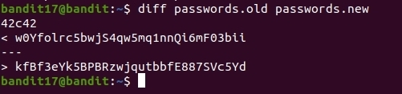

# OverTheWire
## Bandit Level 17 → Level 18
## Level Goal

There are 2 files in the homedirectory: passwords.old and passwords.new. The password for the next level is in passwords.new and is the only line that has been changed between passwords.old and passwords.new

NOTE: if you have solved this level and see ‘Byebye!’ when trying to log into bandit18, this is related to the next level, bandit19

## Commands you may need to solve this level

cat, grep, ls, diff

------------------------------------------------------------------------------

1. While connected to level17 (with private key) from the previous level I continue with level17. 

2. Reading my man pages on the diff command first. I first try on side by side look of the two files and I spot the different lines. 

`diff -y passwords.old passwords.new`

3. I want to get less data on the screen. I run the command with no options. 

`diff passwords.old passwords.new`

4. The different line in the **passwords.new** file is:
**kfBf3eYk5BPBRzwjqutbbfE887SVc5Yd**

5. I will use that as my password to level18. 

6. When connect to level18 it will connect then display "ByeBye !" and disconnect. This is all part of the level18 and 19. 

