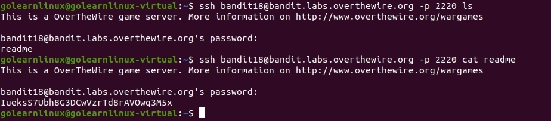

# OverTheWire
## Bandit Level 18 → Level 19
## Level Goal

The password for the next level is stored in a file readme in the homedirectory. Unfortunately, someone has modified .bashrc to log you out when you log in with SSH.

## Commands you may need to solve this level

ssh, ls, cat

------------------------------------------------------------------------------------------------------------------------------------------------------------------

1. Using this command to list all the files in the home directory. 

`ssh bandit18@bandit.labs.overthewire.org -p 2220 ls`

2. I then read the only file in the home directory. 

`ssh bandit18@bandit.labs.overthewire.org -p 2220 cat readme`

3. This gave the next level's password: 

    
